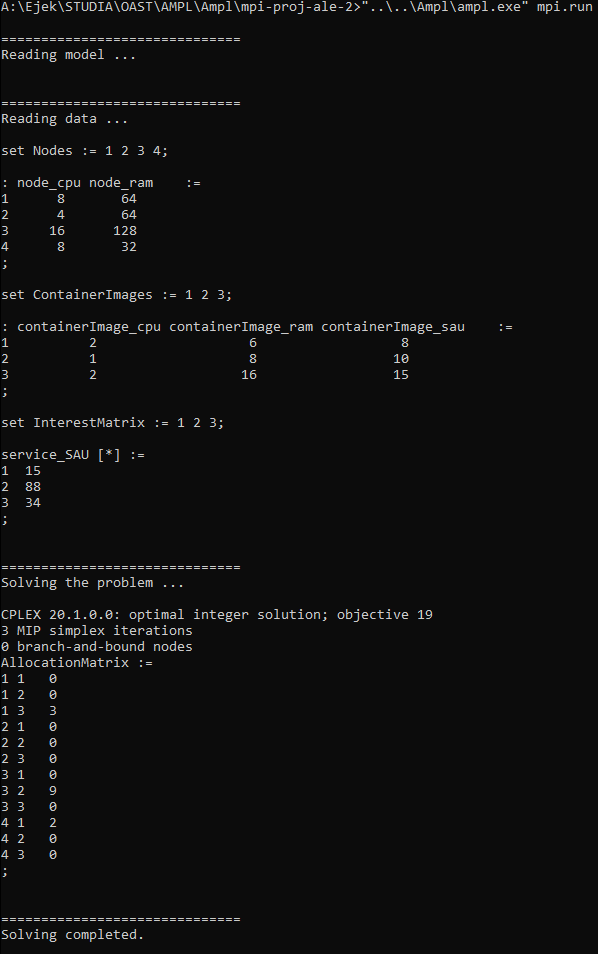

# mpi-proj-ale-drugi

## Słowniczek

**centrum danych**

**węzeł** - hardware, komputer, wyposażenie centrum danych, na których można uruchomić VM lub kontener

**kontener** - wiadomka

**usługa** - którą oferuje przedsiębiorstwo (facebook, netflix) za pośrednictwem *centrum danych*, dla zwykłych ludzi za pośrednictwem internetu. Usługą może być jakiś serwer HTTP (netflix/facebook takimi są), serwer FTP, serwer SMTP itp. Czyli generalnie coś gdzie zwykły człowiek wysyła żądanie, a serwer mu odpowiada. 

**Macierz zainteresowań ruchowym** - daną usługą w danej chwili czasowej jest dane zainteresowanie ruchowe wyrażane jako np. liczba żądań na sekundę

**Obraz kontenera (container image)** - wiadomka, charakteryzowany przez usługę, którą realizuje i zużywane zasoby oraz obsługiwany ruch przez jedną instancję Pod

**Pod (Instancja obrazu kontenera)** - wiadomka też

**Zasoby** - np. ilość rdzeniu CPU oraz pamięć RAM wyrażona w GB

## Opis problemu 

Jest centrum danych, a w nim *węzły*. Centrum danych świadczy jakieś *usługi*. Tych usług może być kilka. W danym momencie/danej chwili czasowej na te usługi jest różne zainteresowanie ruchowe. Pararell centrum danych ma zapisane u siebie *obrazy kontenerów*, które te usługi realizują. Każda intancja kontenera (*Pod*) zajmuje określoną część zasobów. *Pody* można uruchamiać na *węzłach*. Każdy *węzeł* ma swoje określone zasoby. Zadaniem centrum danych jest, to aby zapewnić dostępność usługi. Czyli dla każdej usługi musi uruchomiona odpowiednia liczba kontenerów, aby dały one radę pokryć zainteresowanie ruchowe. Z drugiej strony bez sensu jeśli dla danej usługi uruchomiona jest liczba kontenerów, która łącznie daje dużo ponad to niż wskazuje na to zainteresowanie ruchowe usługi. Tu wchodzi optymalizacja sumaryczna. Z trzeciej strony chcemy, aby *węzły* były równo obciążone, bo tak  - dużo jest powodów na to.

### Matematyczny opis problemu ale na przykładzie

#### Definicja kontenerów

Np.

HTTP-service pro2000 instance: 20kSAU 2GBRAM, 4CPU 
FTP-deamon extra instance  : 10kSAU 2GBRAM, 6CPU

> k - kilo
>
> SAU - Simultaneously Active Users

#### INPUT 

- zasoby data center. Definicja *węzłów* i ich *zasobów*.
- macierz zainteresowań. Mówi ile w tym momencie jest SAU na daną usługę.

#### Algorytm

wylicza ile potrzeba instancji kontenerów, żeby zaspokoić chwilowe zainteresowanie na daną usługę następnie tworzy pod'y w odpowiedniej ilość i rozmieszcza je na węzłach
Funkcją celu tego rozmieszczania jest minimalizacja takiej zmiennej:
mean - średnie procentowe wykorzystanie node'ów
var x = Math.Max(Zbiór{dla każdego węzła `i` : |mean - obiążenie(i)|}).

#### Output

Dla każdego węzła powiedziane jest ile instacji kontenerów z danego obrazu jest uruchomione.

## Model

**Usługa**

```Go
type Service struct {
	Id   Int //nazwa nie jest potrzebna tbh, takie zbiory to i tak się same idkują
    SAU  Int // w milionach czy coś
}
```

**Węzeł**

```go
type Node struct {
	Id   Int //nazwa nie jest potrzebna tbh, takie zbiory to i tak się same idkują
    CPU  Int // [liczba procków]
    RAM  Int // [GB]
}
```

**Obraz Kontenera**

```go
type ContainerImage struct {
    Id          Int 
	ServiceId   Int //wiadomka
    CPU         Int // ile jedna instancja zajmuje procków [liczba procków]
    RAM         Int // ile jedna instancja zajmuje RAM [GB]
    SAU         Int // [kSAU] ile jedna instacja jest w stanie obsłużyć SAU
}
```

**Macierz zainteresowań ruchowych**

```go
type InterestMatrix struct {
	Id   Int       // ID usługi
    SAU  Int       // SAU na usługę
}
```

**OUTPUT**

```go
type AllocationtMatrix struct {
	NodeId             Int         // Id węzła
    ContainerInstances ArrayOfInt  // tablice gdzie indeksami są ID usług a wartościami liczba Pod'ów
}
```

### Przykład

//TODO Wymyśl przykład, opisz słownie, potem zasymuluj algorytm i to wszystko zrzuytuj na model.

**INPUT**

Mamy centrum danych i w nim 4 węzły.

```go
Nodes[ Node{1, 8, 64}, Node{2, 4, 64}, Node{3, 16, 128}, Node{4, 8, 32} ]
```

No i centrum danych oferuje 3 usługi (Netflix, Facebook, Allegro).

Obrazy kontenerów dla usług.

```go
ContainerImages[ ContainerImage{1, 1, 2, 6, 8}, ContainerImage{2, 2, 1, 8, 10},  ContainerImages{3, 3, 2, 16, 15}]
```

Macierz zainteresowań

Łączne zasoby centrum danych to {CPU=36, RAM=288}

Wymyślamy takie zapotrzebowanie, żeby w 50% pokryć centrum danych czyli max CPU=18, RAM=144.

Macierz zainteresowań

```go
InterestMatrix{
    1:      15     // netflix  2  4cpu 12ram
    2:      88     // facebook 9  9cpu 72ram
    3:      34     // allegro  3  6cpu 48ram 
}
```

**OUTPUT**

```go
Nodes[ Node{1, 8, 64}, Node{2, 4, 64}, Node{3, 16, 128}, Node{4, 8, 32} ]
```

```go
ContainerImages[ ContainerImage{1, 1, 2, 6, 8}, ContainerImage{2, 2, 1, 8, 10},  ContainerImages{3, 3, 2, 16, 15}]
```

```go
ContainerCount[ {1, 2}, {2, 9}, {3, 3}]
```

```go
AllocationtMatrix{
    																					                 // mean 57 
    Node 1: {1, }, {2,3} {3, 1}  // wyk: 5cpu 48ram      limit: 8cpu 64ram       62.5%cpu, 75%ram overall 69% ---> 12
    Node 2: {1, 1}, {2, } {3, }  //  wyk: 2cpu, 6ram      limit: 4cpu, 64ram     50%                          ---> 7
    Node 3: {1, }, {2, 4} {3, 2} // wyk: 8cpu, 64ram      limit: 16cpu, 128ram   50%                          ---> 7
    Node 4: {1, 1}, {2,2} {3, }  // wyk: 4cpu, 22ram       limit: 8cpu, 32ram    50%cpu, 69%ram overall 60%   ---> 3 
}
```

## AMPL

**Konstrainty**

- nie możemy na węzłach przekroczyć RAM i CPU
- musimy położyć tyle instancji kontenerów, żeby pokryć zapotrzebowanie

**Optymalizacja**

Funkcją celu tego jest minimalizacja takiej zmiennej:
```go
mean - średnie procentowe wykorzystanie node'ów
var x = Math.Max(Zbiór{dla każdego węzła `i` : |mean - obiążenie(i)|}).
```

## Analiza problemu

https://en.wikipedia.org/wiki/Assignment_problem

https://en.wikipedia.org/wiki/Generalized_assignment_problem

Slajdy Bębena 24-27.

# Pierwsze działające gówno

```ampl
# --------------------------------- P A R A M E T E R S ---------------------------------

param nodeCount, >= 0 integer; # liczba węzłów/nodes w DataCenter
param servicesCount, >= 0 integer; # liczba usług 

set Nodes;      # zbiór węzłów

param node_cpu {Nodes}, >= 0, integer; # funkcja/tablica/mapa która zwraca CPU dla node od danym id
param node_ram {Nodes}, >= 0, integer; # funkcja/tablica/mapa która zwraca RAM dla node od danym id

set ContainerImages;

param containerImage_cpu {ContainerImages}, >= 0, integer; #mapa która zwraca CPU dla danego containerImage
param containerImage_ram {ContainerImages}, >= 0, integer; #mapa która zwraca RAM dla danego containerImage
param containerImage_sau {ContainerImages}, >= 0, integer; #mapa która zwraca SAU dla danego containerImage

set InterestMatrix;

param service_SAU {InterestMatrix} >= 0, integer; #mapa która zwraca SAU dla danej usług

# --------------------------------- V A R I A B L E S ---------------------------------

# rozwiązanie; dla każdego node ile jest odpalonych intancji kontenerów dla każdej usługi
var AllocationMatrix{ n in Nodes, 1..servicesCount }, >=0, integer;
# np. AllocationMatrix[1][2] = 4 na node1 dla service2 mamy 4 instancje


# -------------------------------- S U B J E C T   T O --------------------------------

# constraint na to, żeby pokryć zainteresowanie usługami
subject to sau_satisfaction_constraint { s in InterestMatrix }:		
  sum { n in 1..nodeCount } AllocationMatrix[ n, s ] * containerImage_sau[s] >= service_SAU[ s ];

# constraint na to, żeby na żadnym węźle nie przekroczyć CPU
subject to node_cpu_limit { n in Nodes }:	
   sum { s in 1..servicesCount} AllocationMatrix[n, s] * containerImage_cpu[s] <= node_cpu[n];

# constraint na to, żeby na żadnym węźle nie przekroczyć RAM
subject to node_ram_limit { n in Nodes }:	
   sum { s in 1..servicesCount} AllocationMatrix[n, s] * containerImage_ram[s] <= node_ram[n];

# -------------------------------- M I N I M I Z E --------------------------------
minimize cpu_usage:
   sum {n in Nodes} (AllocationMatrix[n,1]*containerImage_cpu[1] + AllocationMatrix[n,2]*containerImage_cpu[2] + AllocationMatrix[n,3]*containerImage_cpu[3]);

problem gap:
   cpu_usage,

   AllocationMatrix, sau_satisfaction_constraint, node_cpu_limit, node_ram_limit
;
```

Sekcja MINIMIZE jest taka po prostu, żeby było cokolwiek. Tu minimalizacja użycia CPU, czyli zwykłe rozmieszczenie tbh. Trzeba ją podmienić na odpowiednią zmienną do minimalizacji.

Drugi mankament to zhardokodowanie i założenie, że usług jest 3.

Wyszło nam takie o:



Co się totalnie zgadza z wcześniej kminionym przykładem.

Też jak widać constrainty zostały zachowane, żaden węzeł nie jest przeciążony oraz zapotrzebowania na SAU są spełnione.

```go
AllocationtMatrix{
Node 1: {1, }, {2, } {3, 3}  // wyk: 6cpu, 48ram      limit: 8cpu 64ram       
Node 2: {1, }, {2, } {3, }  //  wyk:       limit: 4cpu, 64ram     
Node 3: {1, }, {2,9} {3, } // wyk: 9cpu, 72ram      limit: 16cpu, 128ram   
Node 4: {1,2}, {2, } {3, }  // wyk: 4cpu, 12ram       limit: 8cpu, 32ram   
}
```
## Drugie podejście

```go
mean - średnie procentowe wykorzystanie node'ów
var x = Math.Max(Zbiór{dla każdego węzła `i` : |mean - obiążenie(i)|}).
```

### Max value

Jak masz zbiór W to znalezienie w nim max wartości to

```ampl
max {i in W} i
```

```go
// obiążenia RAM węzłów
```

